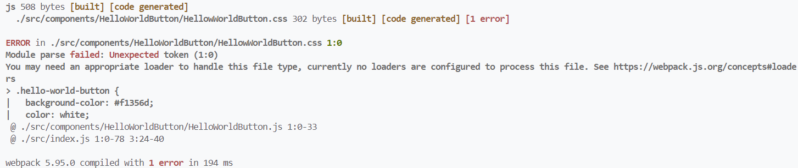

- Webpack allow us to import lot of different stuff in our JS code, this is possible due to great features webpack provides
- In previous section we talked about **Asset Module** which allows us to import images, fonts, text files

### Loaders

- Loaders allow us to import all other kinds of files that you can't handle using Asset Modules
- Using webpack even we can import CSS files in our JS code
- We can import SASS, LESS, handlebars, XML and so much more
- Webpack loaders are JS libraries that help us to load/import all that stuff

#### Handling CSS [Using Loaders]

- While importing CSS class in our JS code, and bundling project with webpack, we got error, as webpack is unaware how to handle css files
  
- Now this can't be achieved through Webpack assets, we need loaders (npm pkgs/libraries) which will read css files, and will include style tags in our HTML file
  1. css-loader
  2. style-loader
